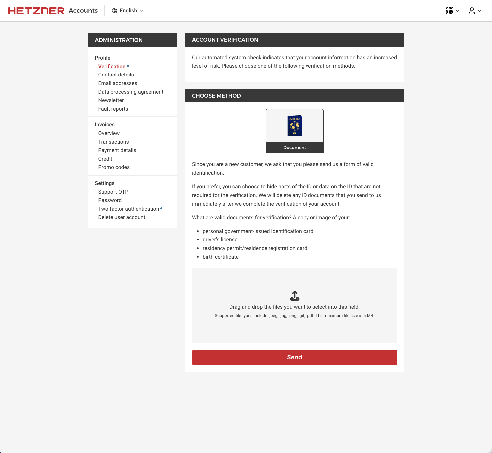
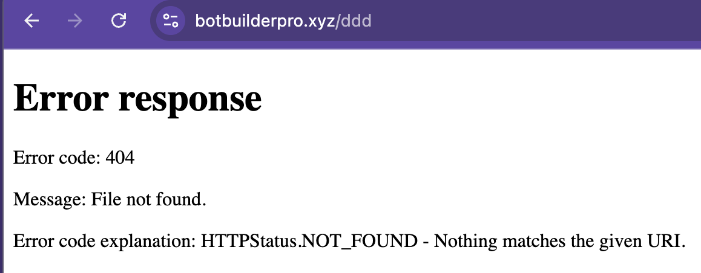

# ideas
* google baited us with API keys that used to be public then were one day billing enabled
* link to blog post
* use "mouse trap" emoji
  * show what % of "public" keys are also private
* blog post: https://trufflesecurity.com/blog/google-api-keys-werent-secrets-but-then-gemini-changed-the-rules
* https://trufflesecurity.com/blog/google-fixes-the-gemini-api-key-privilege-escalation-issue
* and i would love to like, warn these people that they've posted cringe, but i have no way to contact them because i have not paid for access to the WHOIS database.
* performance nerd stuff: httpx actually sucked because it disabled connection keepalive so was walking alllll the way back to doing tls/tcp for every path. 
* also? when i increased the timeout from 3s to 5s it found more secrets. but it found 2x as more in the slower websites than in the ones that responded within 3 seconds? because the people who have slow and bad websites are more likely to ALSO be the ones who are slopping API keys into production

## reasons why this happens
* people running local devservers BRAVELY on the internet on port 443
* serve from directory if file exists yucky pattern
* setting webroot to root dir, not public/

# prepared spells

# """jokes"""""

- "c*ntent creators"
- "AI's primary purpose, stealing the jobs of zoomers"
- for vibe coding, heading "what i imagine happened/what i imagine this looks like": pic of "claujdfe make b2b saas profitable no mistakes"
- 

# stim cave

Wolfgang Amadeus Mozart 2

But it's not as bad as it seems[^seems]

[^seems]: It is tho



#### subheading within

Yap yap yap it was hard.


Anyway this is right after the expand.

# pics dump

HTTPStatus.NOT_FOUND
